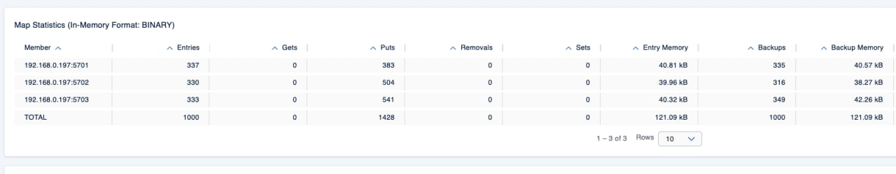
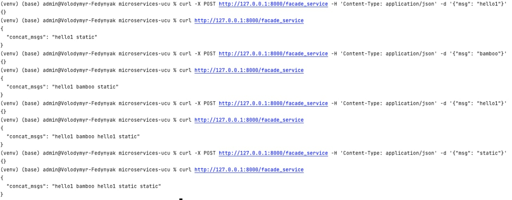
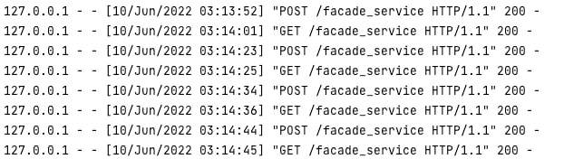

# Task 2

### Distributed map data consistency



Data is equally distributed among nodes



Data is not lost and becomes equally distributed among two nodes



Data is still consistent and remains on the single node

### Distributed map race conditions

```shell
No lock result: 1522
No lock time: 0.730s
Pessimistic lock: result: 3000
Pessimistic lock: time: 2.495s
Optimistic lock: result: 3000
Optimistic lock: time: 1.612s
```

- No lock produces inconsistent results due to race conditions
- Both locks produce correct results, optimistic lock is considerably more efficient

### Bounded queue (max-size 25)


```shell
Produced 0
Produced 1
Produced 2
Produced 3
Produced 4
Produced 5
Produced 6
Produced 7
Produced 8
Produced 9
Produced 10
Produced 11
Produced 12
Produced 13
Produced 14
Produced 15
Produced 16
Produced 17
Produced 18
Produced 19
Produced 20
Produced 21
Produced 22
Produced 23
Produced 24
```
Absence of consumers lead to producer reaching size limit and blocking

```shell
Consumed 35 by 1
Produced 35
Consumed 36 by 0
Produced 36
Consumed 37 by 1
Produced 37
Produced 38
Consumed 38 by 0
Consumed 39 by 1
Produced 39
Produced 40
Consumed 40 by 0
Consumed 41 by 1
Produced 41
Consumed 42 by 0
Produced 42
Produced 43
Consumed 43 by 1
Produced 44
Consumed 44 by 0
Consumed 45 by 1
Produced 45
Consumed 46 by 0
Produced 46
Produced 47
Consumed 47 by 1
Produced 48
Consumed 48 by 0
Produced 49
Consumed 49 by 1
```
In the presence of two consumers the process is more balanced. Both consumers accept data in about equal amounts